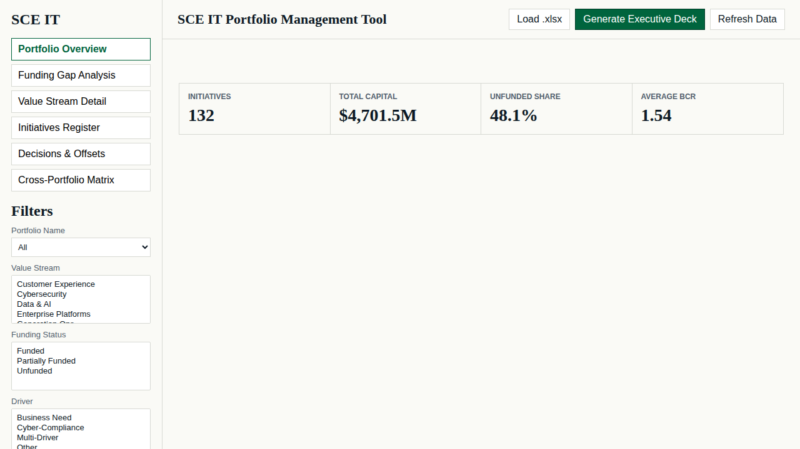

# SCE IT Portfolio Management Tool

A static, single-file-deployable portfolio analytics web app for executive IT capital planning. Quickstart: open `web/index.html` directly in a browser for local review, OR visit the live demo at https://shahidkhan0706.github.io/SCE-IT-Portfolio-Management-Tool/.

## Live demo

- https://shahidkhan0706.github.io/SCE-IT-Portfolio-Management-Tool/

## How to enable Pages (one-time)

> In **Settings → Pages**, set **Source** to **GitHub Actions** once so workflow deployments can publish the app.

## Deploy

The workflow at `.github/workflows/deploy.yml` runs on every push to `main`, packages `web/` as a Pages artifact, deploys with `actions/deploy-pages`, and writes the resulting Pages URL to the workflow summary.

## Screenshot

## Project layout

- `web/` static app (HTML + CSS + vanilla JS + Chart.js + SheetJS + PptxGenJS)
- `web/public/sample/snapshot.json` bundled synthetic snapshot data
- `docs/` data model, slide spec, and connector notes
- `api/` and `infrastructure/` placeholders for future PRs

## References

- [Build Prompt](./SCE_IT_Portfolio_Tool_BUILD_PROMPT.md)
- [Architecture](./ARCHITECTURE.md)
